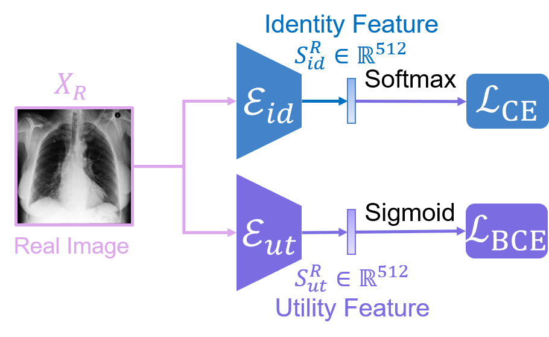

## GMIA-Feature Extractor Training &mdash; Official PyTorch implementation



**Generative Medical Image Anonymization Based on Latent Code Projection and Optimization**<br>
Huiyu Li, Nicholas Ayache, Hervé Delingette<br>
<!-- ToDo<br> -->
https://inria.hal.science/tel-04875160<br> (Chapter3-4)

## Requirements
* 64-bit Python 3.9 pytorch==1.13.0 torchvision==0.14.0 torchaudio==0.13.0 pytorch-cuda=11.7. See [https://pytorch.org/](https://pytorch.org/) for PyTorch install instructions.

## Getting started

## Preparing datasets
**MIMIC-CXR-JPG**:
Step 1: Download the [MIMIC-CXR-JPG dataset](https://physionet.org/content/mimic-cxr-jpg/2.1.0/).

Step 2: Dataset Pre-processing accoring to the [repository](https://github.com/Huiyu-Li/GMIA-Dataset-Pre-processing/tree/main).

## Training the networks

### Identity network training
Train the idenity network on the original dataset.<br>
```.bash
OMP_NUM_THREADS=8 torchrun --nproc_per_node=2 --nnodes=1 ./Model_Pretrain/identity_classification.py
```

Train the idenity network on the anonymized dataset.<br>
```.bash
OMP_NUM_THREADS=8 torchrun --nproc_per_node=2 --nnodes=1 ./Model_Pretrain/identityA_classification.py
```

### Utility network training
Train the utility network on the original dataset.<br>
```.bash
python3 ./Model_Pretrain/utility_classification_CheXclusion_uDense.py
```

Train the utility network on the anonymized dataset.<br>
```.bash
python3 ./Model_Pretrain/utilityA_classification_CheXclusion_uDense.py
```

## Evaluating the networks

Evaluate the identity network on the original dataset.<br>
```.bash
python3 ./Evaluate/identity_eval.py
```

Evaluate the Inner linability risk of the anonymized dataset.<br>
```.bash
python3 ./Evaluate/identityI_eval.py
```

Evaluate the Outer linability risk of the anonymized dataset.<br>
```.bash
python3 ./Evaluate/identityO_eval.py
```

Evaluate the utility network on the original dataset.<br>
```.bash
python3 ./Evaluate/utility_eval_CheXclusion_uDense.py
```

Evaluate the utility network on the anonymized dataset.<br>
```.bash
python3 ./Evaluate/utilityA_eval_CheXclusion_uDense.py
```

References:
1. [GANs Trained by a Two Time-Scale Update Rule Converge to a Local Nash Equilibrium](https://arxiv.org/abs/1706.08500), Heusel et al. 2017
2. [Demystifying MMD GANs](https://arxiv.org/abs/1801.01401), Bi&nacute;kowski et al. 2018
3. [Improved Precision and Recall Metric for Assessing Generative Models](https://arxiv.org/abs/1904.06991), Kynk&auml;&auml;nniemi et al. 2019
4. [Improved Techniques for Training GANs](https://arxiv.org/abs/1606.03498), Salimans et al. 2016
5. [A Style-Based Generator Architecture for Generative Adversarial Networks](https://arxiv.org/abs/1812.04948), Karras et al. 2018


## Citation

<!-- ToDo<br> -->
```
@phdthesis{li:tel-04875160,
  TITLE = {{Data Exfiltration and Anonymization of Medical Images based on Generative Models}},
  AUTHOR = {Li, Huiyu},
  URL = {https://inria.hal.science/tel-04875160},
  SCHOOL = {{Inria \& Universit{\'e} Cote d'Azur, Sophia Antipolis, France}},
  YEAR = {2024},
  MONTH = Nov,
  KEYWORDS = {Privacy and security ; Steganography ; Medical image anonymization ; Identity-utility extraction ; Latent code optimization ; Data exfiltration attack ; Attaque d'exfiltration de donn{\'e}es ; Compression d'images ; Confidentialit{\'e} ; St{\'e}ganographie ; Anonymisation d'images m{\'e}dicales ; Extraction d'identit{\'e}-utilit{\'e} ; Optimisation du code latent},
  TYPE = {Theses},
  PDF = {https://inria.hal.science/tel-04875160v2/file/Huiyu_Thesis_ED_STIC.pdf},
  HAL_ID = {tel-04875160},
  HAL_VERSION = {v2},
}
```